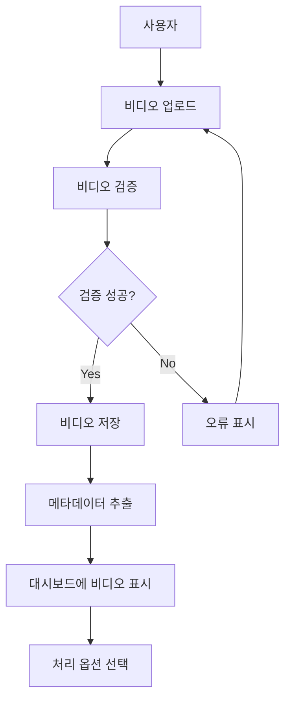
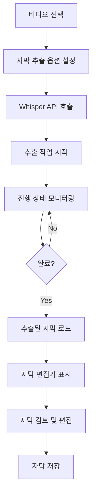
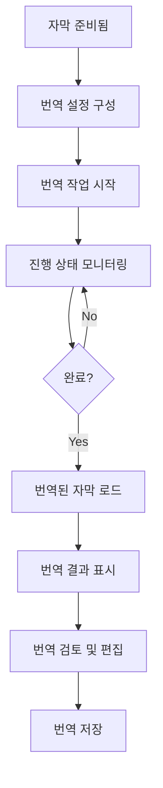
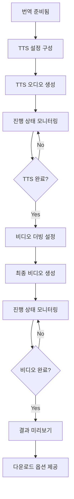

# 비디오 번역 및 더빙 자동화 도구 - 애플리케이션 흐름

## 1. 개요

이 문서는 비디오 번역 및 더빙 자동화 도구의 애플리케이션 흐름을 설명합니다. 사용자가 비디오를 업로드하면, OpenAI Whisper API를 통해 자막을 추출하고, AI를 활용하여 자막을 번역한 후, TTS(Text-to-Speech)를 통해 음성을 생성하여 최종적으로 더빙된 비디오를 제공하는 전체 과정을 기술합니다.

## 2. 사용자 여정 (User Journey)

### 2.1 사용자 로그인
- 사용자는 계정으로 로그인하거나 새 계정을 생성합니다.
- 소셜 로그인(Google, GitHub 등) 옵션도 제공됩니다.
- 사용자 인증 후, 개인 대시보드로 이동합니다.

### 2.2 비디오 업로드
- 사용자는 로컬 파일 시스템에서 비디오를 선택하여 업로드합니다.
- 지원되는 비디오 형식: MP4, MOV, AVI, MKV 등
- 업로드 중 진행 상태가 표시됩니다.
- 업로드된 비디오는 서버에서 처리되기 전에 기본 검증 과정을 거칩니다.

### 2.3 자막 추출 (Whisper API)
- 업로드된 비디오에서 OpenAI Whisper API를 사용하여 자동으로 자막을 추출합니다.
- 사용자는 Whisper 모델 옵션을 선택할 수 있습니다:
  - 모델 크기: 초소형(tiny), 기본형(base), 소형(small), 중형(medium), 대형(large-v3)
  - 언어 설정: 자동 감지 또는 특정 언어 지정
  - 세그먼트 설정: 최대 세그먼트 길이, 최소 묵음 간격 등
- 추출 진행 상태가 실시간으로 표시됩니다.
- 추출이 완료되면 자막 편집기에서 결과를 확인하고 수정할 수 있습니다.

### 2.4 번역 설정
- 사용자는 타겟 언어(들)를 선택합니다.
- 번역 모델 옵션 선택:
  - AI 모델: GPT-4, GPT-3.5-Turbo 등
  - 번역 톤: 공식적, 대화체, 캐주얼 등
  - 용어집: 특정 용어에 대한 번역 지정 가능
- 번역 컨텍스트 설정: 비디오의 주제나 분야를 지정하여 보다 정확한 번역을 얻을 수 있습니다.

### 2.5 번역 처리
- 선택한 설정에 따라 자막이 번역됩니다.
- 번역 진행 상태가 실시간으로 표시됩니다.
- 번역이 완료되면 사용자는 번역된 자막을 검토하고 필요시 편집할 수 있습니다.

### 2.6 TTS 설정
- 사용자는 각 타겟 언어에 대한 TTS 옵션을 선택합니다:
  - 음성 선택: 성별, 억양, 스타일 등
  - 음성 조정: 말하기 속도, 피치, 볼륨 등
  - 세그먼트간 침묵 시간 설정
- TTS 샘플을 미리 들어볼 수 있습니다.

### 2.7 더빙 비디오 생성
- 선택한 설정에 따라 TTS 오디오가 생성됩니다.
- 생성된 오디오는 원본 비디오와 동기화되어 더빙된 비디오가 생성됩니다.
- 사용자는 추가 옵션을 선택할 수 있습니다:
  - 자막 포함 여부
  - 자막 스타일 (위치, 크기, 색상, 배경 등)
  - 원본 오디오 볼륨 (음소거, 감쇠 등)
  - 출력 품질 및 형식

### 2.8 결과 확인 및 다운로드
- 더빙된 비디오의 미리보기를 제공합니다.
- 사용자는 결과에 만족하면 최종 비디오를 다운로드할 수 있습니다.
- 다운로드 옵션: 비디오 파일, 자막 파일(SRT, VTT 등), 오디오 파일 등
- 프로젝트는 사용자 계정에 저장되어 나중에 다시 접근하거나 수정할 수 있습니다.

### 2.9 대안 경로
- **기존 자막 업로드**: 비디오와 함께 SRT, VTT 등의 자막 파일을 직접 업로드할 수 있습니다.
- **일괄 처리**: 여러 비디오를 일괄적으로 처리할 수 있습니다.
- **API 통합**: 외부 시스템에서 API를 통해 서비스를 활용할 수 있습니다.
- **단일 단계 실행**: 사용자가 원하는 경우 전체 과정을 한 번에 실행할 수 있습니다.

## 3. 프로세스 흐름 (Process Flow)

### 3.1 비디오 업로드 및 처리 파이프라인

### 3.2 자막 추출 프로세스 (Whisper API)

### 3.3 번역 프로세스

### 3.4 TTS 및 비디오 생성

## 4. 인터페이스 흐름 (Interface Flow)

### 4.1 메인 대시보드
- 사용자의 모든 프로젝트 목록 표시
- 새 프로젝트 시작 버튼
- 기존 프로젝트 관리 옵션
- 계정 설정 및 사용량 통계

### 4.2 비디오 업로드 인터페이스
- 드래그 앤 드롭 영역
- 파일 탐색기 통합
- 업로드 진행 상태 표시
- 지원되는 형식 안내

### 4.3 자막 편집기
- 비디오 플레이어와 통합된 자막 편집 인터페이스
- 타임라인 기반 세그먼트 조정
- 텍스트 편집 도구
- 자동 저장 기능

### 4.4 번역 인터페이스
- 원본 자막과 번역된 자막 병렬 표시
- 세그먼트별 번역 편집
- 용어집 관리
- 다중 언어 지원

### 4.5 TTS 설정 인터페이스
- 음성 선택 및 미리 듣기
- 파라미터 조정 슬라이더
- 세그먼트별 오디오 미리보기
- 사용자 지정 음성 프로필 저장

### 4.6 최종 비디오 미리보기
- 비디오 플레이어
- 언어 전환 옵션
- 자막 표시 옵션
- 품질 및 형식 선택

## 5. 오류 처리 및 예외 상황

### 5.1 업로드 오류
- 파일 크기 초과
- 지원되지 않는 형식
- 네트워크 중단
- 서버 오류

### 5.2 Whisper API 오류
- 오디오 품질 문제
- API 서비스 불가
- 언어 감지 실패
- 처리 시간 초과

### 5.3 번역 오류
- 모델 서비스 불가
- 지원되지 않는 언어 쌍
- 컨텍스트 길이 초과
- 번역 품질 문제

### 5.4 TTS 오류
- 음성 생성 실패
- 지원되지 않는 언어
- 처리 용량 초과
- 오디오 동기화 문제

### 5.5 비디오 생성 오류
- 인코딩 실패
- 리소스 부족
- 타임아웃
- 동기화 오류

## 6. 프로젝트 상태 관리 및 스토리지

### 6.1 세션 관리
- 로그인 상태 유지
- 작업 진행 상태 저장
- 자동 저장 및 복구

### 6.2 임시 스토리지
- 업로드된 원본 파일
- 처리 중인 중간 결과물
- 브라우저 캐시 활용

### 6.3 영구 스토리지
- 완료된 프로젝트
- 사용자 설정 및 프로필
- 과금 및 사용량 정보

## 7. 고급 시나리오

### 7.1 일괄 처리
- 다중 비디오 업로드 및 처리
- 일괄 설정 적용
- 진행 상황 대시보드
- 결과 일괄 다운로드

### 7.2 고급 편집 기능
- 자막 타이밍 미세 조정
- 음성 오버랩 처리
- 복잡한 형식 보존
- 커스텀 스타일 적용

### 7.3 팀 협업
- 프로젝트 공유
- 역할 기반 접근 제어
- 변경 기록 및 버전 관리
- 댓글 및 피드백

### 7.4 API 통합
- 외부 시스템에서 서비스 접근
- 웹훅 및 이벤트 알림
- 사용자 정의 워크플로우
- 자동화 통합

## 8. Whisper API 통합 상세

### 8.1 모델 선택
- **whisper-tiny**: 매우 빠른 처리, 최소 리소스 사용, 기본적인 정확도
- **whisper-base**: 빠른 처리, 낮은 리소스 사용, 개선된 기본 정확도
- **whisper-small**: 적절한 처리 속도, 중간 리소스 사용, 좋은 정확도
- **whisper-medium**: 균형 잡힌 성능과 정확도, 높은 리소스 사용
- **whisper-large-v3**: 최고 정확도, 다언어 지원 강화, 매우 높은 리소스 사용

### 8.2 매개변수 최적화
- **language**: 자동 감지 또는 특정 언어 지정으로 정확도 향상
- **temperature**: 낮은 온도(0.0)는 결정적 출력, 높은 온도는 다양한 출력
- **timestamp_granularity**: 세그먼트 또는 단어 단위 타임스탬프
- **segments.max_length**: 세그먼트 길이 제한으로 메모리 사용 최적화
- **segments.min_silence**: 자연스러운 세그먼트 분할을 위한 묵음 감지
- **initial_prompt**: 특정 포맷이나 도메인에 맞는 초기 프롬프트 제공
- **response_format**: JSON, SRT, VTT 등 다양한 출력 형식 지원

### 8.3 결과 처리
- JSON 형식의 전체 트랜스크립트 및 세그먼트 목록
- 세그먼트별 시작/종료 시간 및 신뢰도 점수
- 다양한 자막 형식 변환(SRT, VTT 등)
- 메타데이터 활용(언어 감지, 평균 신뢰도 등)

### 8.4 사용자 정의 옵션
- 인식 정확도와 처리 속도 간의 균형 조정
- 특정 도메인에 맞는 후처리 규칙 적용
- 품질 문제가 있는 오디오에 대한 강화 전략
- 배치 크기 및 처리 대기열 관리